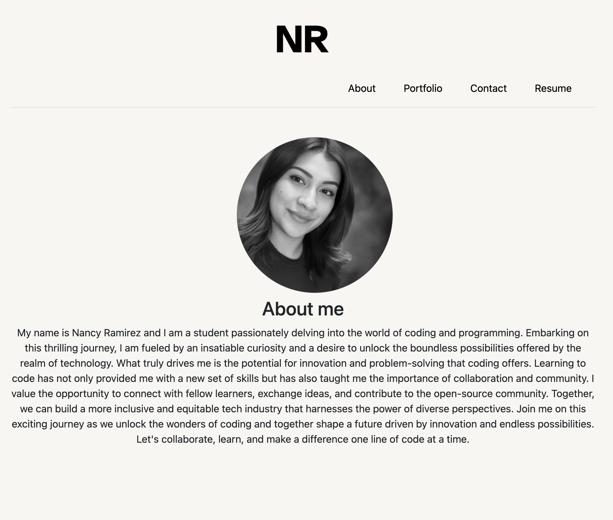
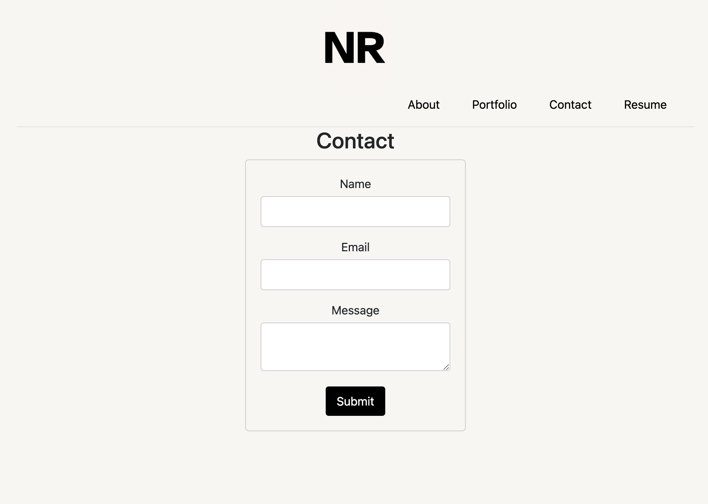

# nancy-dev-portfolio

This project was a challenge where I created a portfolio website from scratch. It was a challenging task, but I gained React.js experience!

## Installation Instructions

To access the project, you'll need to navigate to the client directory ("cd client") then NPM install and once dependencies are installed you can "npm run dev" to display app.

## Features

- Header Navigation: Presents the developer's name/logo and navigation links.
- About Me: Displays a recent photo/avatar of the developer and a brief biography.
- Portfolio: Showcases projects with deployed versions and GitHub links.
- Contact: Offers a contact form with fields for name, email, and message.
- Resume: Provides a downloadable link to the developer's resume and skills list.
- Footer: Contains links to the developer's GitHub, LinkedIn, and another platform.

## License

This project is released under the MIT License. Feel free to use the challenges and solutions provided here for personal or educational purposes.

## Badges

